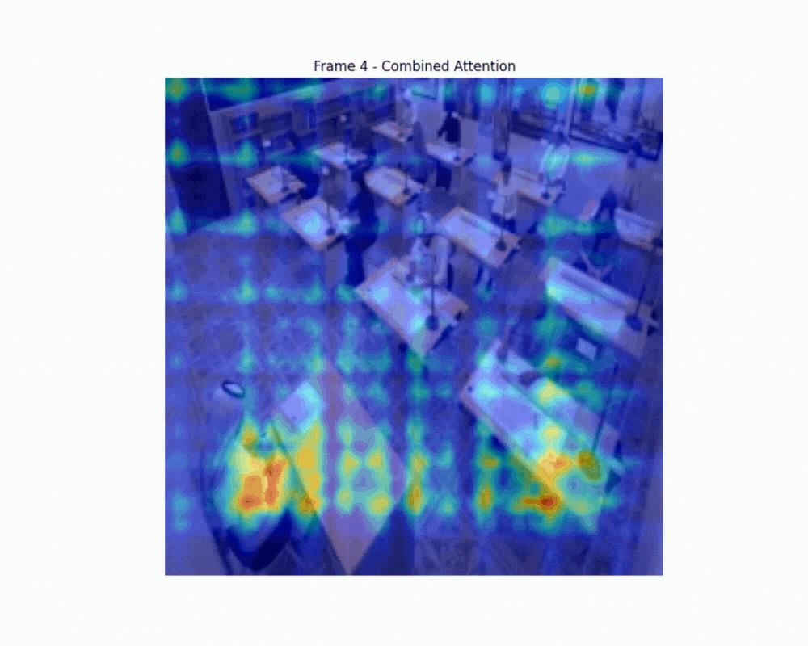

# Project: Real-Time Gaze Tracking for Enhanced Student Engagement: Introducing MS-GESCAM in Classroom Settings
 
 ## Overview
 This repository is part of a collaborative project by Group 5 in the 18-799-RW Applied Computer Vision Course at CMU-Africa. Our project seeks to provide a cost-effective, scalable solution for gaze tracking in educational settings and provide actionable feedback. 
 
 This repository contains code for training and evaluating gaze estimation models on the GESCAM dataset. The system detects where people in classroom environments are looking based on their head position and appearance.

 The GESCAM system uses a multi-stream architecture to predict gaze targets in classroom settings. The model takes as input:

1. The full classroom image
2. A crop of each person's head
3. A binary mask showing the head's location in the image

From these inputs, the model predicts:

1. A heatmap showing where the person is looking
2. A probability indicating whether the person is looking inside or outside the frame

The input and output is summarized in the video below:

 ## Project Objective
 The project objectives are to track the students' gaze in real time using affordable webcams to ensure accessibility for schools, analyze real-time gaze and classroom context to provide clear and actionable feedback for teachers, ensure the system works effectively in diverse settings, such as large lecture halls or online classes, to support scalability, and develop a model that can be integrated into video conferencing tools such as Zoom or Google Meet.
 
 ## Committing Experiments
 This repository serves as a comprehensive record of all experiments conducted for the project which will allow all the group members and stakeholders to track progress and ensure transparency in our research project.
 
 ## Datasets
The GESCAM dataset consists of annotated classroom images with:

1. Person bounding boxes
2. Gaze direction polylines
3. Frame metadata

The dataset loader processes these annotations to create training samples by matching each person to their corresponding gaze target. For more information about the GESCAM dataset used in our experiments, visit [GESCAM Project Page](https://athulmmathew.github.io/GESCAM/).
 
## Model Architecture

The MS-GESCAM model uses a multi-stream architecture:

### Head Pathway

Processes the head crop using a ResNet18 backbone and extracts features representing head pose and orientation

### Scene Pathway

Processes the full scene image plus head position mask and identifies potential gaze targets in the environment

### Attention Mechanism

Uses head features to generate an attention map. It focuses the model on relevant regions of the scene

### Fusion and Decoding

Combines attended scene features with head features and then decodes it  into a heatmap representing gaze location. It then predicts whether the person is looking inside or outside the frame

## Results

Current validation metrics:

1. __AUC__: 0.6197 ± 0.1300
2. __Distance Error__: 0.4264 ± 0.2001
3. __Angular Error__: 0.01° ± 0.01°
4. __In-frame Accuracy__: 1.0000

For comparison, state-of-the-art results from the papers:

1. AUC of 0.921 on GazeFollow dataset
2. AUC of 0.860 on VideoAttentionTarget dataset
3. AUC of 0.943 on the full GESCAM dataset

## Visualization

The system generates multiple types of visualizations:

### Individual predictions

1. Scene image with person bounding box
2. Predicted and ground truth gaze heatmaps
3. Heatmap overlays on the original image
4. Error heatmap showing prediction differences

### Attention heatmap video

Combined heatmap showing where everyone in the classroom is looking
Helps identify attention hotspots and patterns

For a combined weighted attention, the video below shows the aggregated instance of gaze direction per frame

## POST MIDTERM

Performance improvements:

1. Train for more epochs
2. Use more data or better augmentation
3. Experiment with different architectures

### Analysis tools:

1. Quantify classroom attention patterns
2. Identify areas of high/low student engagement
3. Track attention over time

## Applications:

1. Real-time classroom attention monitoring
2. Educational research tools
3. Feedback systems for teachers

 ## Group 5 Members Contacts
 - bkoech@andrew.cmu.edu
 - ooe@andrew.cmu.edu
 - amuhairw@andrew.cmu.edu
 
 ## Acknowledgments
 Special thanks to our course instructors (Prof: Moise, Prof: Assane, and Gabrial) and our TA mentor (Brian Bosho) for their guidance and support throughout the project.
