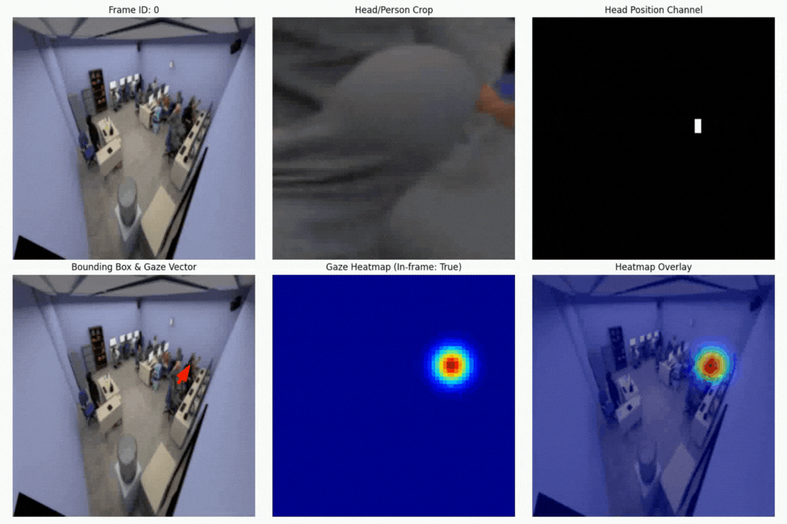

# GESCAM: Gaze Estimation for Classroom Attention Measurement

This repository contains code for training and evaluating gaze estimation models on the GESCAM dataset. The system detects where people in classroom environments are looking based on their head position and appearance.
Overview
The GESCAM system uses a multi-stream architecture to predict gaze targets in classroom settings. The model takes as input:

1. The full classroom image
2. A crop of each person's head
3. A binary mask showing the head's location in the image

From these inputs, the model predicts:

1. A heatmap showing where the person is looking
2. A probability indicating whether the person is looking inside or outside the frame

The input and output is summarized in the video below:

## Dataset

The GESCAM dataset consists of annotated classroom images with:

1. Person bounding boxes
2. Gaze direction polylines
3. Frame metadata

The dataset loader processes these annotations to create training samples by matching each person to their corresponding gaze target.

## Model Architecture

The MS-GESCAM model uses a multi-stream architecture:

### Head Pathway

Processes the head crop using a ResNet18 backbone and extracts features representing head pose and orientation

### Scene Pathway

Processes the full scene image plus head position mask and identifies potential gaze targets in the environment

### Attention Mechanism

Uses head features to generate an attention map. It focuses the model on relevant regions of the scene

### Fusion and Decoding

Combines attended scene features with head features and then decodes it  into a heatmap representing gaze location. It then predicts whether the person is looking inside or outside the frame

## Results

Current validation metrics:

1. __AUC__: 0.6197 ± 0.1300
2. __Distance Error__: 0.4264 ± 0.2001
3. __Angular Error__: 0.01° ± 0.01°
4. __In-frame Accuracy__: 1.0000

For comparison, state-of-the-art results from the papers:

1. AUC of 0.921 on GazeFollow dataset
2. AUC of 0.860 on VideoAttentionTarget dataset
3. AUC of 0.943 on the full GESCAM dataset

## Visualization

The system generates multiple types of visualizations:

### Individual predictions

1. Scene image with person bounding box
2. Predicted and ground truth gaze heatmaps
3. Heatmap overlays on the original image
4. Error heatmap showing prediction differences

### Attention heatmap video

Combined heatmap showing where everyone in the classroom is looking
Helps identify attention hotspots and patterns

## POST MIDTERM

Performance improvements:

1. Train for more epochs
2. Use more data or better augmentation
3. Experiment with different architectures

### Analysis tools:

1. Quantify classroom attention patterns
2. Identify areas of high/low student engagement
3. Track attention over time

## Applications:

1. Real-time classroom attention monitoring
2. Educational research tools
3. Feedback systems for teachers
